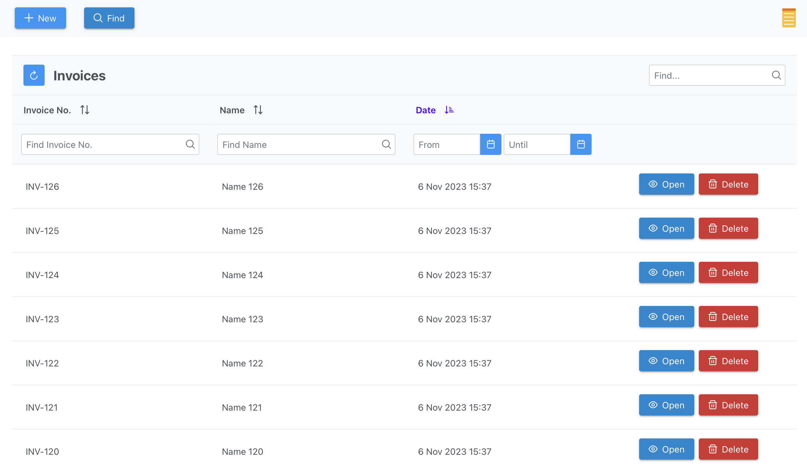

# InvoiceHub: Simple Invoicing

This web application provides a user-friendly interface for creating and managing invoices. It includes features such as a search page for easy retrieval of past invoices and the ability to generate PDFs for printing.

[invoice.ivancasenda.com](https://invoice.ivancasenda.com)

## Features

- Search Page: Quickly search and retrieve invoices based on various parameters, facilitating efficient management.
- Invoice Creation: Easily create and customize invoices using the intuitive user interface.
- PDF Print: Generate professional PDF versions of invoices for easy sharing and storage.

## InvoiceHub (FrontEnd)

[`invoicehub-fe`](invoicehub-fe)
This project was generated with [Angular CLI](https://github.com/angular/angular-cli) version 10.1.4.

### Prerequisites

- **Angular:** The application is built with Angular, web framework.

- **PrimeNG:** PrimeNG is a rich set of open source native Angular UI components..

- **Docker & VSCode:**
  The Visual Studio Code Dev Containers extension lets you use a container as a full-featured development environment. It allows you to open any folder inside (or mounted into) a container and take advantage of Visual Studio Code's full feature set

### Build

Run `ng build` to build the project. The build artifacts will be stored in the `dist/` directory.

### Development server

Run `ng serve` for a dev server. Navigate to `http://localhost:4200/`. The application will automatically reload if you change any of the source files.

## InvoiceHub (BackEnd)

[`invoicehub-be`](invoicehub-be)
API service for invoice web application built with Java, Spring Boot.

### Features

- **Spring Boot:** A tool that makes developing web application and microservices with Spring Framework faster and easier through Autoconfiguration

- **Hibernate ORM:** Object–relational mapping tool for the Java programming language. It provides a framework for mapping an object-oriented domain model to a relational database

- **Elasticsearch:** Allows you to store, search, and analyze huge volumes of data quickly and in near real-time and give back answers in milliseconds. It's able to achieve fast search responses because instead of searching the text directly, it searches an index.

- **JasperReports:** Open source Java reporting tool that can write to a variety of targets, such as: screen, a printer, into PDF, HTML, Microsoft Excel, RTF, ODT, comma-separated values, XSL, or XML files.

### Prerequisites

- **Docker & VSCode:**
  The Visual Studio Code Dev Containers extension lets you use a container as a full-featured development environment. It allows you to open any folder inside (or mounted into) a container and take advantage of Visual Studio Code's full feature set

### Build

Run `mvn package -P {profile}` to build the project. The build jar will be stored in the `target/` directory.

### Development server

Run `mvn spring-boot:run` for a dev server. Navigate to `http://localhost:8080/`. The application will automatically reload if you change any of the source files.
